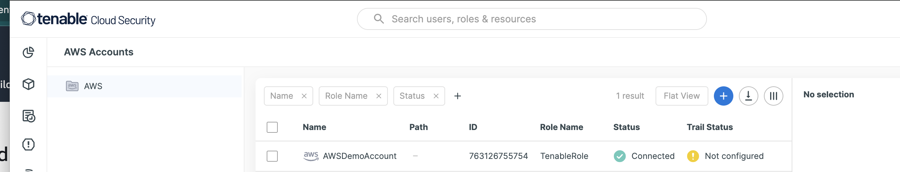
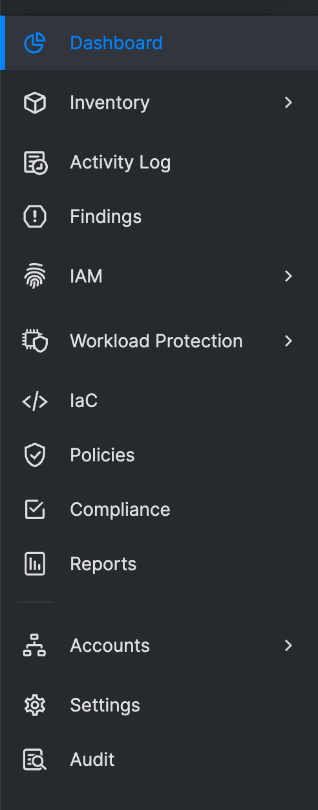

[IMAGEDIR]: "images/LeftHandMenu.png"

# Tenable Cloud Secuirty Lab Workbook - Module 1

## Introduction

This document outlines test scripts designed as a startup guide:
1.  Onboard Tenable Cloud Security and AWS account
1.  Navigate the console  
    1.  Overview of menu options
1.  Overview of the Dashboard
1.  Integration tools
1.  Documentation/help
1.  Using CNAPPgoat tools

### Test Environment

- **Cloud Provider(s):** AWS  

**Note**:  *Tenable Cloud Security is a mulit-cloud solutions for AWS, GCP, and Microsoft Azure*
- **Tenable Cloud Security**
- **Lab Platform:** AWSJams

### Prerequisites

- Unique login to Tenable Cloud Security platform with [view, collaborator, administrator] log in permissions.
- AWS account.
- Pre-defined compliance standards and policies.

## Test Steps

### 1.  Onboaording AWS 

[Reference - Onboard an Account](https://docs.ermetic.com/v1/docs/onboard-aws#onboard-an-account)

1.  `Login` on to Tenable Cloud Security (https://cloud.tenable.com/
1.  `Select` to the **Tenable Cloud Security** menu tile
1.  Connect to AWS account  
    1.  `Navigate` to the left menu
    1.  `Select` **Accounts->AWS**
    1.  `Click` on **Add Account**
    1.  `Type` in a Name of the Account (ie.  **AWSDemoAccount**)
    1.  `Click` on **Active Regions** pull-down menu and 
        1.  `Select`  **us-east-1, us-east-2, us-west-1, and us-west-2**
        1.  Leave other selections blank
    1.  `Click` on **Next**
    1.  `Enable` the following features
        1.  Monitoring (read-only)
        1.  Remediation (read-write)
        1.  EC2 Instance Scanning
        1.  ECR Scanning
    1.  `Click` on **Next**
    1.  While the **Cloud Formation (AWS Console)** is selected
        1.  `Click` on **click here**
    This will generate the Cloud Formation Template with the proper IAM roles and permissions to connect with Tenable Cloud Security and guide you to **Create** a Cloud Formation stack.
    (ie.  **CloudFormation->Stacks->Create Stack**)

    1.  If you haven't done so already, `Login` to the AWS Console.
    1.  In the <u>AWS Console</u>  
        1.  `Verify` the parameters
        1.  `Scroll` down to the bottom of the page
        1.  `Check` the **Acknowledge** statement
        1.  `Click` on **Create Stack**
        1.  When completed `Click` on **Outputs**
        1.  `Copy/record` the **Role ARN**
    1.  On the <u>Tenable Cloud Security</u> dashboard
        1.   `Paste` the **Role ARN** from the step above.
        1.  `Click` on **Next** to complete
        **Note:  Cloud Trail configuration will not be completed in this module, however you can follow the directions in teh documenation if you want to continue adding Cloud Trail
        1.  `Click` on **Finish**
        1.  `Click` on **Done**

**Note:** Depending on the size of the account (assests/services) the system can take several minutes to process the data in the account.

    
### 1. Navigating through the Dashboard Console

#### Objective

Navigate to different areas of the product by using left hand navigation menu and widges

#### Steps

1. `Move` mouse pointer to far-left menu with icons.  Notice the pullout menu item

[Left Menu Description](https://docs.ermetic.com/docs/navigate-the-console#lefthand-navigation-menu)

For a detailed description goto to 

1.  Goto the "Dashboard"
Table explains the dashboard

https://docs.ermetic.com/docs/dashboard#dashboard-widgets

Toxic Combinations

https://docs.ermetic.com/docs/dashboard#list-of-toxic-combinations

1.  User Profile

1. **Initiate Discovery:**
   - Navigate to the asset discovery section.
   - Trigger a manual discovery scan or wait for the next scheduled scan.

1. **Verify Discovery:**
   - Check the list of discovered assets in Tenable Cloud Security.
   - Confirm that all deployed resources are accurately identified and listed.

1. **Documentation:**
   - Take screenshots or export the list of discovered assets.
   - Document any discrepancies or issues.

### 1. Compliance Monitoring

#### Objective

Ensure that Tenable Cloud Security can assess cloud environments against pre-defined compliance standards and policies.

#### Steps

1. **Define Compliance Standards:**
   - Verify that compliance standards (e.g., CIS AWS Foundations Benchmark) are configured in the platform.

1. **Conduct Compliance Scan:**
   - Initiate a compliance scan against your cloud environment.

1. **Evaluate Results:**
   - Review the compliance assessment report.
   - Check for any violations or non-compliant resources.

1. **Remediation Verification:**
   - Apply remediation steps to non-compliant resources.
   - Re-run the compliance scan to verify fixes.

1. **Documentation:**
   - Record findings, remediation actions, and post-remediation results.

### 1. Vulnerability Assessment

#### Objective

Test the capability of Tenable Cloud Security to identify vulnerabilities within the cloud environment.

#### Steps

1. **Setup:**
   - Ensure cloud resources with known vulnerabilities are present in your test environment.

1. **Run Vulnerability Scan:**
   - Navigate to the vulnerability assessment section.
   - Initiate a scan of your cloud environment.

1. **Analyze Results:**
   - Examine the vulnerability assessment report for identified risks.
   - Verify that known vulnerabilities are detected.

1. **Remediation and Reassessment:**
   - Address identified vulnerabilities.
   - Perform another scan to confirm the effectiveness of remediation measures.

1. **Documentation:**
   - Document the initial findings, remedial actions taken, and the results of the reassessment scan.

### Conclusion

This set of test scripts provides a baseline for evaluating the CSPM features of Tenable Cloud Security. Adjustments may be required based on specific cloud configurations and organizational security policies.
